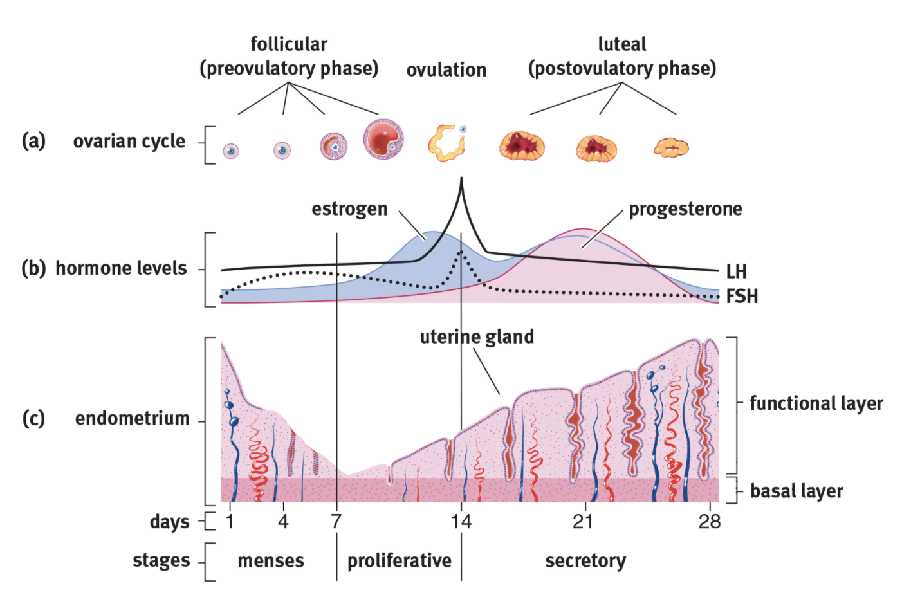

# This page has information about me

I am a student at Columbia University's Mailman School of Public Health


## Here's a subsection

And here's some additional text...

```{r}
rnorm(10)
```

## Links to other websites

let's link to useful tools for data science:

* [Google](https://www.google.com)
* [P8105](https://p8105.com)

## Local image




## Link to page within the site
[about](about_me.html)
